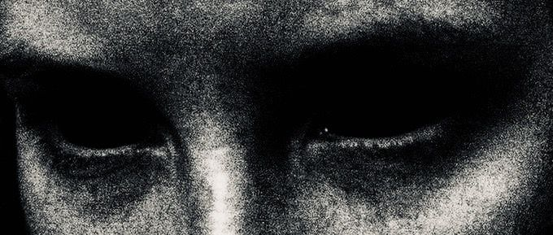
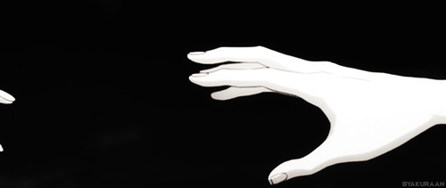
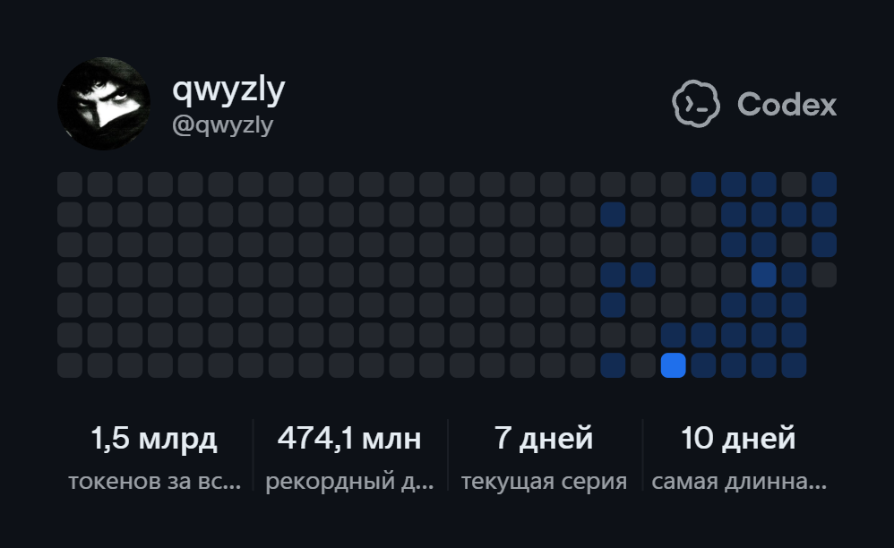

<p align="center">
  
</p>

<p align="center">
  
</p>

<h1 align="center">qwyzly</h1>


<p align="center">
  
</p>

<p align="center">
  <a href="https://github.com/qwyzly/dalagame.qz">dalagame.qz</a>
  ·
  <a href="https://github.com/qwyzly">GitHub</a>
</p>

---

### About

```txt
profile: qwyzly
status: building in the dark
project: dalagame.qz
style: black / quiet / mysterious
```

### Main Project

`dalagame.qz` - мой главный проект.  
Темная игровая атмосфера, аккуратный интерфейс и сайт, который должен выглядеть как место со своей историей.

### Tech

<p>
  
  
  
</p>

### Direction

```txt
> clean pages
> dark visual mood
> simple interactions
> no noise
```

---

<p align="center">
  <sub>the screen is black, but the project is alive.</sub>
</p>
